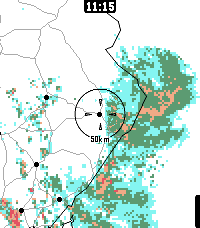

# Rain Map Finland

Pebble watch app for viewing recent rain radar data in Finland.

### Makefile

The project uses _Makefile_ to define common build routines.

### TypeScript PKJS

The PKJS side of the app is implemented in TypeScript. Compared to a
conventional JavaScript implementation, TS build commands are defined in
_package.json_ and executed in _wscript_.

### Radar data

Radar data is downloaded from the Finnish Meteorological Institute's (FMI) open
data service, https://en.ilmatieteenlaitos.fi/open-data-manual-radar-data.

### Map data

Map data is based on [OpenStreetMap](https://www.openstreetmap.org) data,
preprocessed for app performance. See _scripts/create_map_data_resources.py_.
